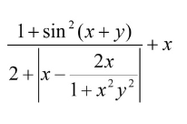
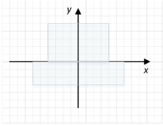
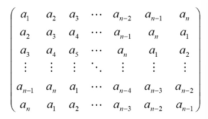
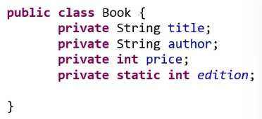
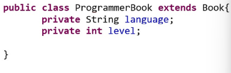

# WT
 Web Tech Java language
---
## Lab №1
### Task №1
* Вычислить значение выражения по формуле (все переменные принимают действительные значения). 
Для модульного тестирования приложения разработайте JUnit-тесты.
* Calculate the value of the expression using the formula (all variables take real values). 
Create JUnit tests for unit testing of the application.
* 
### Task №2
* Для данной области составить программу, котораяпечатает true, если точка с координатами (х, у) принадлежит закрашенной области, и false — в противном случае. 
Для модульного тестирования приложения разработайте JUnit-тесты.
* Create a program for the given area that prints true if the point with coordinates (x, y) belongs to the painted area and false otherwise. 
Create JUnit tests for unit testing of the application.
* 
### Task №3
* Составить программу для вычисления значений функции F(x) на отрезке [а, b] с шагом h. Результат представить в виде таблицы, первый столбец которой – значения аргумента, второй - соответствующие значения функции.
Для модульного тестирования приложения разработайте JUnit-тесты.
* Write a program to calculate the values of the function F(x) on the segment [a, b] with step h. Present the result in the form of a table, the first column of which is the values of the argument, the second column is the corresponding values of the function.
Create JUnit tests for modular testing of the application.
F(x) = tan(x)
### Task №4
* Задан целочисленный массив размерности N.
Определить, есть ли среди элементов массива простые числа. Если да, то вывести номера этих элементов. 
Для модульного тестирования приложения разработайте JUnit-тесты.
* An integer array of dimension N is given.
Determine whether there are prime numbers among the array elements. If yes, print the numbers of these elements. 
Create JUnit tests for unit testing of the application.
### Task №5
* Дана целочисленная таблица А[n]. Найти наименьшее число K элементов, которые можно выкинуть из данной последовательности, так чтобы осталась возрастающая подпоследовательность. 
Для модульного тестирования приложения разработайте JUnit-тесты.
* An integer table A[n] is given. Find the smallest number K of elements that can be removed from this sequence so that an increasing subsequence remains. 
Create JUnit tests for unit testing of the application.
### Task №6
* Даны действительные числа a1, a2, …, an. Получить следующую квадратную матрицу порядка n. 
Для модульного тестирования приложения разработайте JUnit-тесты.
* The real numbers a1, a2, ..., an are given. Obtain the following square matrix of order n. 
Create JUnit tests for unit testing of the application.
* 
### Task №7
* Дан массив n действительных чисел. Требуется упорядочить его по возрастанию. 
Делается это следующим образом: сравниваются два соседних элемента ai и ai+1 . Если ai <= ai+1, то продвигаются на один элемент вперед. Если ai > ai+1, то производится перестановка и сдвигаются на один элемент назад. Составить алгоритм этой сортировки. 
Для модульного тестирования приложения разработайте JUnit-тесты.
* An array of n real numbers is given. It is required to order it in ascending order. 
This is done as follows: two neighboring elements ai and ai+1 are compared. If ai <= ai+1 , then one element is moved forward. If ai > ai+1 , then a permutation is performed and they are moved one element back. Compose an algorithm for this sorting. 
Create JUnit tests for unit testing of the application.
### Task №8
* Пусть даны две неубывающие последовательности действительных чисел a1 <= a2 <= … <=an и b1 <= b2 <= … <= bm. 
Требуется указать те места, на которые нужно вставлять элементы последовательности b1 <= b2 <= … <= bm в первую последовательность так, чтобы новая последовательность оставалась возрастающей. 
Для модульного тестирования приложения разработайте JUnit-тесты.
* Let two non-decreasing sequences of real numbers a1 <= a2 <= ... <=an and b1 <= b2 <= ... <= bm. 
It is required to specify the places at which the elements of the sequence b1 <= b2 <= ... <= bm should be inserted into the first sequence so that the new sequence remains increasing. 
Create JUnit tests for unit testing of the application.
### Task №9
* Создать класс Мяч. Создать класс Корзина. Наполнить корзину мячиками. Определить вес мячиков в корзине и количество синих мячиков. 
Для модульного тестирования приложения создать JUnit-тесты.
* Create a class Ball. Create the Basket class. Fill the basket with balls. Determine the weight of balls in the basket and the number of blue balls. 
Create JUnit tests for unit testing of the application.
### Task №10
* Скомпилировать и запустить приложение, созданное при решении задачи 9 из командной строки.
* Compile and run the application created in Task 9 from the command line.
### Task №11
* Создать запускной jar-файл и запустить приложение, созданное при решении задачи 9.
* Create a startup jar file and run the application created when solving Task 9.
### Task №12
* Переопределить методы equals(), hashCode() и toString().
Не пользуясь средствами автогенерации кода переопределить для класса Book методы equals(), hashCode() и toString().
* Override methods equals(), hashCode() and toString().
Override equals(), hashCode() and toString() methods for Book class without using code autogeneration tools.
* 
### Task №13
* Переопределить методы equals(), hashCode() и toString().
Не пользуясь средствами автогенерации кода переопределить для класса ProgrammerBook методы equals(), hashCode() и toString().
* Override methods equals(), hashCode() and toString().
Override equals(), hashCode() and toString() methods for ProgrammerBook class without using code autogeneration tools.
* 
### Task №14
* Переопределить метод clone(). Не пользуясь средствами автогенерации кода переопределить для класса Book из задачи 12 метод clone(). 
Напишите тесты JUnit, проверяющие корректность клонирования.
* Override the clone() method. Override the clone() method for the Book class from task 12 without using code autogeneration tools. 
Create JUnit tests that check the correctness of cloning.
### Task №15
* Реализовать интерфейс Comparable.
Добавьте в класс Book из задачи 12 поле isbn. Реализуйте в классе Book интерфейс Comparable так, чтобы книги приобрели сортировку по умолчанию согласно номеру isbn. 
Напишите тесты JUnit, проверяющие корректность сортировки.
* Implement the Comparable interface.
Add the isbn field to the Book class from problem 12. Implement the Comparable interface in the Book class so that books are sorted by default according to the isbn number. 
Create JUnit tests to check if the sorting is correct.
### Task №16
* Реализовать интерфейс Comparator.
Реализуйте для класса Book из задачи 12 компараторы, позволяющие сортировать книги по названию; по названию, а потом по автору; по автору, а потом по названию; по автору, названию и цене. 
Напишите тесты JUnit, проверяющие корректность сортировок.
* Implement the Comparator interface.
Implement comparators for the Book class from Problem 12 that allow you to sort books by title; by title and then by author; by author and then by title; by author, title and price. 
Create JUnit tests that check the correctness of sorting.
---
## Lab №2
---
## Lab №3
---
## Lab №4
